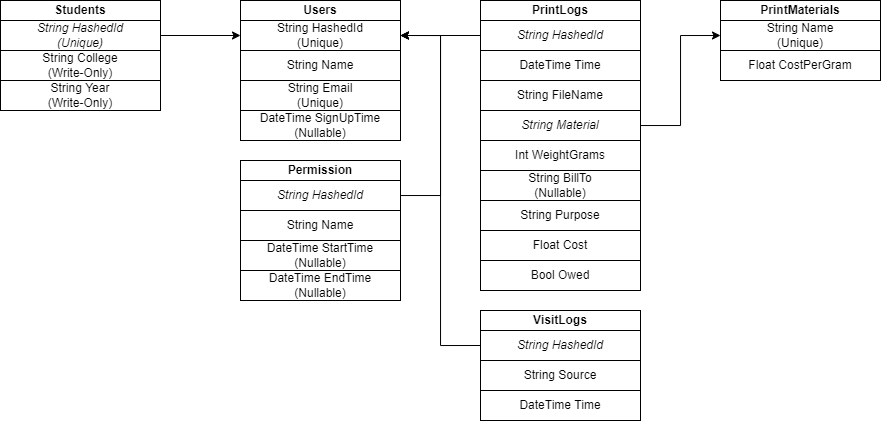

# Database Design
This document covers the design for the data in the database. It
does not cover the data design in the requests.

# Tables

The starting table of the database is the `User`s table, which contained
the hashed (university) id as the primary key, their name, their email (which
is unique but not the primary key), and a signup date. This was not
populated in the old system, so it will be null for users before the
deployment of the system. In a seprate table is information about the user
as a student. The `Student`s table stores the college and year of the student
seprately to reduce null fields for non-students if the system were to be used
in that way. The fields are currently only used for analytics.

Users are referenced in 3 other tables:
- `Permission`s - Users can have permissions for resources, such as `LabManager`,
  with an optional `StartDate` and `EndDate`. No uniqueness constraints are given
  to allow for multiple ranges of dates for the same permission.
- `PrintLog`s - After being registered, users are allowed to print. A lot of information
  is tracked about the print, including the time it was printed, name of the file,
  material of the print (which points to a `PrintMaterial`s table for the cost, and
  optionally more fields later), the weight of the print in games, who to bill to
  (such as Senior Design), the purpose of the print, the cost of the print, and
  if the print is owed. The cost is stored instead of calculated in case the price
  of filament were to change.
- `VisitLog`s - Users can have a history of when they visited eith their
  source, such as `"MainLab"`, and the time they visited. An end time is not
  stored because sign-outs are not recoded. For analytic, total visits is important
  while duration visited isn't.

## Microsoft Entity Framework
Since the project uses Microsoft Entity Framework, the changes to the data include:
- Add an artificial primary key (`Key`) to `Student`s, `Permission`s, `VisitLog`s, 
  and `PrintLog`s since Microsoft Entity Framework requires an explicit primary key.
- Reference `HashedId` in `Student`s, `PrintLog`s, `Permission`s, and `VisitLog`s
  as `User` for the foriegn key constraints.
- Referencee `Material` in `PrintLog`s as `PrintMaterial` for the foreign key constraint.
- Add `List<Permission>`, `List<VisitLog>`, and `List<PrintLog>` to `User` for easier
  fetching of data.

# Making Data Changes
In order to make changes to the data schema (i.e. adding or removing fields
to tables), a couple steps are required:
1. Modify the fields to the [database models](../Construct.Core/Database/Model).
2. Run the [CreateMigrate.py](../scripts/CreateMigrate.py) script to create
   the "migrates" (instructions on how to update the tables). A name will be
   required to identify the migrate.
3. Run the unit tests for `Construct.Core` to ensure the changes can be run.
   Some tests may fail due to the new data, so they will need to be updated.
4. Commit the changes.

When the deployed application is updated and re-deployed, the migrates will update
the database. If the migrates cause issues, the application will fail to start.