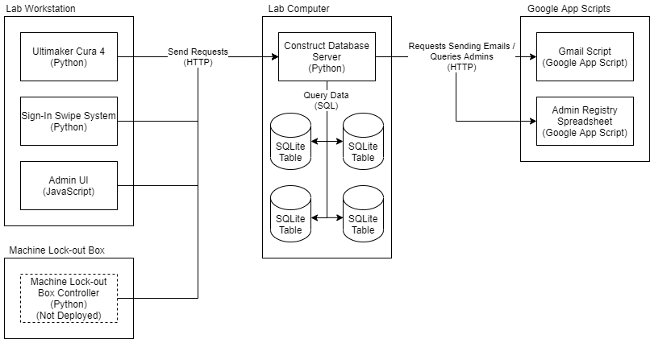
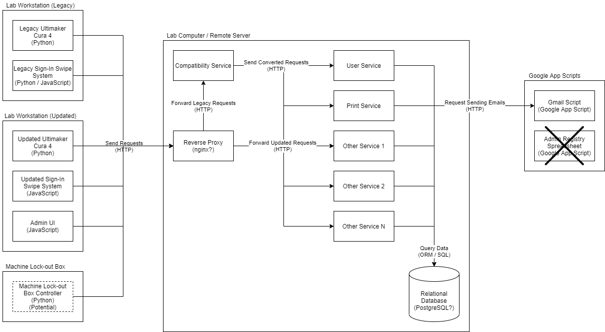

# Initial Plan
This document covers the initial, high-level plan for the project, including:
* The initial design (not open-sourced currently) and the current flaws.
* Goals for the new system.
* Planned tools for the project and the justification for them.
* Deployment of the new system.

The document is also written at the time of the new system being planned and
the existing still being in use. The "existing system" at the time of reading
may this system.

# Current Architecture
The current architecture includes a single, monolithic (but small) server with
a few applications that talk directly to it. The systems currently includes
a custom sign-up system in the main lab where users swipe their university
id (known as the "Swipe System"), Ultimaker Cura for preparing 3D prints, 
and a custom admin system for managing prints exported from Cura. A machine
lock-out system has been explored before and some code for it exists, but the
feature was cancelled. Google App Scripts is used externally for 2 different use
cases: sending emails, and storing information about users.



# Existing System
The existing system is a fairly small Python-based web server using SQLite
for storing data. The system has been in use for a few years and had a major
refactor, but no functionality was removed. The system doesn't have that many
strange quirks, except for how database tables are handled. For performance
reasons, each database table has an independent file, which makes SQL JOINs
impossible and adds overhead on the developer to combine the required data.

Python was initially picked because it is used in Computer Science 1, compared
to a language like Java which is covered in Computer Science 2 or C# which isn't
covered by any required course. Python also has the advantage of being easy to
edit and change the platform of. However, problems have come up with the existing
system, including:
* Runtime errors appearing due to uncaught syntax erorrs.
* Direct SQL queries are used, and SQL is not covered in Computer Science 1
  or Computer Science 2.
* Minimal security is included in the server. If someone wanted to flood the
  server with thousands of valid requests, they will be accepted.
* Everything for the server is contained together. This has led to confusion
  when looking through the endpoints to figure out the purpose, as well as
  unrelated changes breaking other endpoints.
* The database is unencrypted and doesn't use a proper backup method.
* Automation ests have been explored, but depend on the state and aren't complete.
  No unit tests are used, and the current code isn't easy to unit test.
* Not all the data stored is useful. The current year of the user is stored when
  they sign up, but no information exists about when they did that.
* There is no redundancy for a failure, and a lab environment is more likely to
  cause a failure than a server room.

# New System Goals
The goals of the new system include:
* Improve the deployment strategy of the server to be less manual.
* Prepare to move the deployment of the server from a Windows system to potentially:
  * A local Windows development system.
  * A local Linux development system.
  * A local Windows release system.
  * A remote Linux system.
  * (Stretch; has open questions) Docker containers.
* Make collected data more useful, like the year of the user, or remove it.
* Keep the compatibility of existing endpoints and create new, simpler ones. This mostly
  affects Cura that has a mix of emails and university ids instead of just university ids.
* Use language-based queries instead of SQL queries. This practice is known as Object-relational
  mapping, or ORM. This would also be paired with programming language objects for database
  entries instead of pairs of keys and values.
* Migrate the user swipe system to a web application.
* Make the components of the system into better defined services with clearer endpoints.
* Improve the security of the server so that brute-force attacks and others can't be easily done.
* Add SSL to the server.

# Proposed Architecture
From the outside, not a whole lot changes for what the user sees. It will still appear as 1
server, ideally with the same port number using a reverse proxy, like nginx, but internally
would be made of a series of small and independently deployable services.



The clients are a bit more involved since it involve clients that haven't been updated
and ones that have. With time, the clients will be updated and the old clients will no
longer be relevant, but a period of time will be required to go back if something goes
wrong. For external services, the admin registry would be internallized, but the email
code would be kept external. Inside the server, a proper relational database server would
be used, although SQLite may be used in testing. The services shown in the diagram
would ideally be a dedicated process, and might be in Docker containers.

Also note that the "Legacy Sign-In Swipe System" is "Python / JavaScript". A change in the
plans was made to expidite migrating the swipe system to a web browser application. This is
due to a problem with window management in preparation for the Fall 2021-2022 semester.

## Services
The following services are currently promposed as a non-complete list:
- User service - Service for returning user information and adding new users.
- Session service - Service for storing sessions about users, such as users
  entering the main lab.
- Print service - Service for 3D printing in the print lab for logging prints and
  managing print balances.
- Machine Swipe service - Potential service for the lock-out boxes for machines.
- Admin service - UI service for managing print balances.
- Compatibility service - Temporary service for converting old requests to the
  new system. Eventually would be decommissioned long after everything is updated.

## Deployment
Deployments of the current server involve manually updating files on the desktop it is
deployed to, including manual stops and starting. If a change was made that would result
in a unit test to fail and a problem to occur, the update wouldn't be stopped. With a proper
deployment, a single script should be able to run that:
* Downloads the latest code.
* Runs the unit tests of the code.
* Builds the code (currently not required for Python).
* Stops the existing deployment.
* Deploy the service(s).

For example, if a change was made that only affects a few services, a command should be able
to run for just that service. For example:
```bash
python deploy User Swipe
```

For deploying all the services, there would be 2 options:
* All - Deploys all the services individually.
```bash
python deploy All
```
* Combined - Deploys all the services as 1 process. Intended for local testing.
```bash
python deploy Combined
```

## Proposed Tools
* C# - Compiled, typed language that runs directly on the operating system.
  * C# is similar but not the same as Java. A proper development environment / IDE should be
    be able to compensate for part of the learning curve for those coming from Computer Science 2
    where Java is taught.
* Microsoft Entity Framework - Object-Relational Mapping (ORM) library for C# that allows performing
  database queries without SQL. It also allows for changing database providers easily, which is why
  the database service hasn't been finalized and SQLite may still be used in development.
* ASP.NET - C# web framework for creating web services.
* PostgreSQL - High-performance, open-source, and free relational database server. Services like MySQL
  have extra licensing costs depending on the deployment.
* (Potential) Docker - Docker may be useful for deploying the services. C# can be deployed directly
  between architectures and operating systems. More research is required.
* GitHub - Version control software for managing the code. *This tool is already in use.*

# Rollout
Rollout would start on the existing desktop in the main lab and eventually be migrated to a suitable
server for hosting. Internet connectivity and system stability have been problematic before, and security
patches have been harder to manage with the server code being active.

The in-development rollout of the server would be done in stages based on services being completed.
The method of how needs to be researched because data is required in both services. One way that
could be done is having temporary code that replicates data to the legacy database files. Either way,
the database tables are expected to be slightly different that prevents them from using the same files.
All of this requires the server to be kept on the same system.

When development is completed, all the clients will be changed to point to the new server and will be able
to be reverted if something goes wrong, although the goal is to have suitable unit testing ahead of time
to reduce internal problems. Eventually, the server will be migrated to a remote (Linux/Unix-compatible?)
server, which will require migrating all data. A more gradual rollout can be done after that with just
moving the database first and changing the existing code to point to it, then deploy the server code on
the remote server and change some clients to use it, then change all clients to point it, and then finally
decommission the old server code. Performing for a full migration at the same time may need to be planned
for depending on if the database can be exposed to the internet or not.

# Open Questions
* The current question asking what year they are has been considered not usable, but can anything replace
  it? Start years can't determine when a user is expected to leave, and expected end years can change.
* Is Docker the right solution for this if the services are processes and the database is remote?

# Risks
* The proposed architecture is more complex.
* C# is different enough to Java for new students to cause issues. Code comments to explain the business
  logic will be more important.
* A Senior Design project is being started at the same time that will require coordination for data migration.
* The intended server for deployment is mostly unknown.
  * The server reports it is RedHat Enterprise Linux (RHEL), but what can be ran is not.
  * Arbitrary ports may not be able to be opened.
  * How RIT handles SSL is unknown.
* How SSL needs to be handled is unknown. nginx can handle SSL certificates and redirecting, but using nginx
  is unknown.
* Code coverage using GitHub Actions has been suggested, but this tool hasn't been explored.
* The feature set of ASP.NET hasn't been explored before.