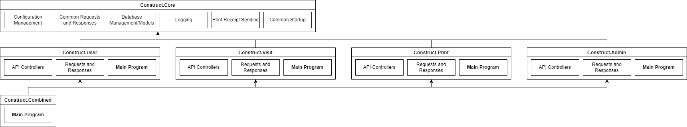

# Project Design
This document covers the high-level design of the modules.

# Application Modules

The modules of the design have 3 layers:
1. `Construct.Core` - Core library used by the individual services,
   such as common models, database management, and startup code for
   the application. If logic is specific to 1 application, it is most
   likely put in that application's module instead of the common one.
   Individual requests and responses are also stored in the modules
   of the applications.
2. `Construct.User`, `Construct.Swipe`, `Construct.Print`, `Construct.Admin` - 
   Individual applications that can each be run independently on different
   ports. They contain the "API Controllers" (logic for accepting requests)
   and the request/response modules specific to them.
3. `Construct.Combined` - References all of the modules in the tier
   above so they can be run under a single port. No additional logic,
   controllers, or models are added. This is only intended for development
   systems and deployments where a request router like nginx can't be used.

# Test Modules
Along with the modules listed above for the application, there are more
modules intended for testing. There are 3 types:
1. `Construct.Base.Test` - Core library for code used between the tests,
   but does not contain runnable tests.
2. `Construct.Generate.Test` - Helper application for generating a mock
   database. *It will not run if the configured database has users.*
3. All other `Construct.*.Test` - Runs actual tests on the code, including
   the core library and applications. The tests include unit tests for
   individual components, functional tests for code-level tests with
   functioning components (like SQLite databases), and integration tests
   for testing at the HTTP API level instead of code level.

Due to technical limitations and a lack of maturity with tools like Embedded
Postgres in C# for functional testing, 100% code coverage is not practical with
these tests. When adding new application modules, it is **strongly recommended**
to add new test modules and test what can be tested (some modules have 100%
code coverage for example).